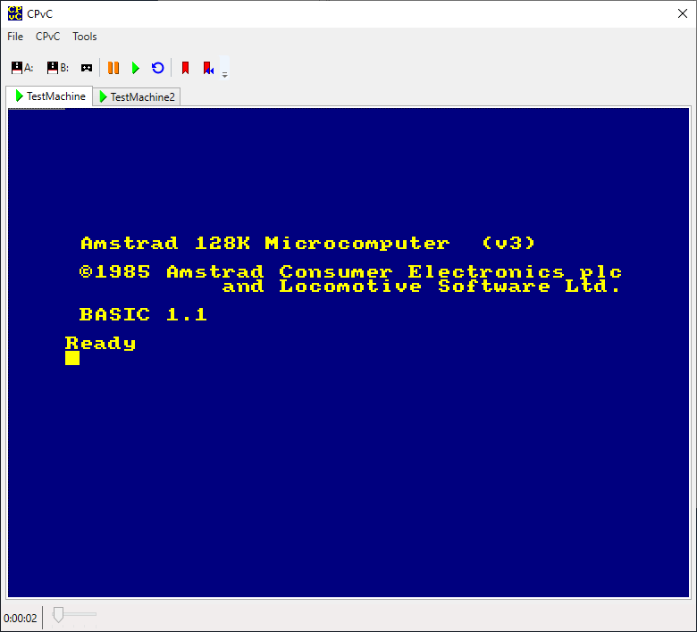

# CPvC features

The main CPvC window appears as follows:

## File menu

### New

Creates a new CPvC machine. The user will be prompted for a file to save the new machine to.

### Open

Opens an existing instance of a CPvC machine. The machine will be opened in a paused state and at the same point it was when it was last closed.

### Close

Closes the currently selected machine. Note that a bookmark is automatically created at the moment the machine is closed, so that the machine can be resumed at the same point it was closed.

## CPvC menu

### Drive A:/B:

Loads a floppy disc image to either drive A: or B:. Amstrad CPC disc images have the "DSK" extension.

Zip archives can also be loaded, provided they contain a .DSK file. If multiple .DSK files exist in a zip archive, then the user is prompted to select one.

### Tape

Loads a tape image. Amstrad CPC tape images have either a "CDT" or "TZX" extension.

Zip archives can also be loaded, provided they contain a .CDT/.TZX file. If multiple .CDT/.TZX files exist in a zip archive, then the user is prompted to select one.

### Pause

Pauses the currently selected machine.

### Resume

Resumes the currently selected machine.

### Reset

Performs a soft reset on the currently selected machine. Note that a soft reset doesn't affect the discs or tape currently loaded in the machine.

### Add Bookmark

Adds a bookmark to the currently selected machine. This allows a user to later return to, and continue from, this point in the machine's history, creating a new branch in the timeline.

### Jump to Bookmark

Opens a dialog displaying all bookmarks for the currently selected machine, and prompts for the user to select one. The machine is reverted to this point in the timeline, and a new branch is created.

### Properties

Opens a dialog displaying information on the currently selected machine. The following are exposed within the dialog:

* Machine Name: Display the machine, and allow the name to be changed.
* Compact Machine File: When clicked, compacts the machine's file to save space. Useful after deleting bookmarks.
* History: Shows the same timeline as in "Jump to Bookmark", but with the ability to delete bookmarks and branches. This functionality is accessed by right clicking a row in the history.
